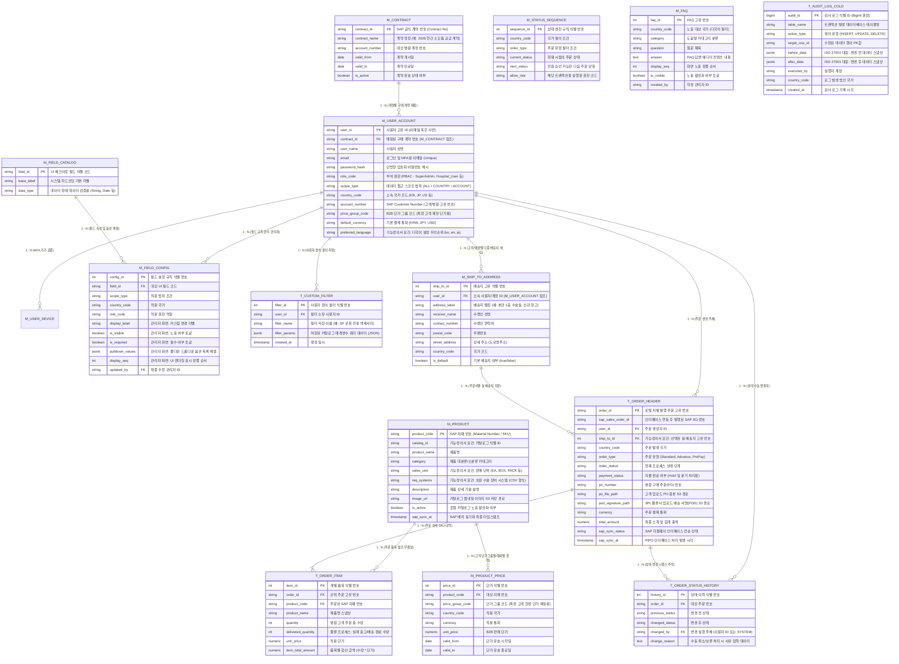

```mermaid
erDiagram
    %% ==========================================
    %% 1. 관계(Relationships) 정의
    %% ==========================================
    
    %% 사용자 / 권한 / 마스터 매핑
    M_USER_ACCOUNT ||--o{ M_USER_DEVICE : "1 : N (MFA 기기 검증)"
    M_USER_ACCOUNT ||--o{ T_ORDER_HEADER : "1 : N (주문 생성 주체)"
    M_USER_ACCOUNT ||--o{ M_FIELD_CONFIG : "1 : N (필드 규칙 관리 관리자)"
    M_USER_ACCOUNT ||--o{ T_ORDER_STATUS_HISTORY : "1 : N (상태 수동 변경자)"
    M_USER_ACCOUNT ||--o{ T_CUSTOM_FILTER : "1 : N (사용자 정의 필터 저장)"
    M_USER_ACCOUNT ||--o{ M_SHIP_TO_ADDRESS : "1 : N (고객/병원별 다중 배송지 세팅)"
    
    %% B2B 글로벌 계약 거버넌스 관계
    M_CONTRACT ||--o{ M_USER_ACCOUNT : "1 : N (계정별 구매 계약 매핑)"
    
    %% 동적 UI 카탈로그 관계
    M_FIELD_CATALOG ||--o{ M_FIELD_CONFIG : "1 : N (필드 속성 및 옵션 확장)"
    
    %% 상품 및 단가 거버넌스 관계
    M_PRODUCT ||--o{ M_PRODUCT_PRICE : "1 : N (고객 단가그룹별/통화별 정책)"
    M_PRODUCT ||--o{ T_ORDER_ITEM : "1 : N (주문 품목 참조 무결성)"
    
    %% 주문 트랜잭션 및 타임라인 관계
    T_ORDER_HEADER ||--|{ T_ORDER_ITEM : "1 : N (주문 상세 SKU 내역)"
    T_ORDER_HEADER ||--o{ T_ORDER_STATUS_HISTORY : "1 : N (상태 변경 시퀀스 추적)"
    M_SHIP_TO_ADDRESS ||--o{ T_ORDER_HEADER : "1 : N (주문서별 실 배송지 지정)"

    %% ==========================================
    %% 2. 엔티티(Entities) 정의 및 필드 상세
    %% ==========================================

    M_USER_ACCOUNT {
        string user_id PK "사용자 고유 ID (이메일 혹은 사번)"
        string contract_id FK "매핑된 구매 계약 번호 (M_CONTRACT 참조)"
        string user_name "사용자 성명"
        string email "로그인 및 MFA용 이메일 (Unique)"
        string password_hash "단방향 암호화 비밀번호 해시"
        string role_code "부여 권한 (RBAC - SuperAdmin, Hospital_User 등)"
        string scope_type "데이터 접근 스코프 범위 (ALL / COUNTRY / ACCOUNT)"
        string country_code "소속 국가 코드 (KR, JP, US 등)"
        string account_number "SAP Customer Number (고객/병원 고유 번호)"
        string price_group_code "B2B 단가 그룹 코드 (특정 고객 제한 단가용)"
        string default_currency "기본 결제 통화 (KRW, JPY, USD)"
        string preferred_language "기능정의서 요건: 다국어 설정 우선순위 (ko, en, ja)"
    }

    M_SHIP_TO_ADDRESS {
        int ship_to_id PK "배송지 고유 식별 번호"
        string user_id FK "소속 사용자/계정 ID (M_USER_ACCOUNT 참조)"
        string address_label "배송지 별칭 (예: 본관 1층 수술실, 신관 창고)"
        string receiver_name "수령인 성명"
        string contact_number "수령인 연락처"
        string postal_code "우편번호"
        string street_address "상세 주소 (도로명주소)"
        string country_code "국가 코드"
        boolean is_default "기본 배송지 여부 (true/false)"
    }

    M_PRODUCT {
        string product_code PK "SAP 자재 번호 (Material Number / SKU)"
        string catalog_id "기능정의서 요건: 카탈로그 식별 ID"
        string product_name "제품명"
        string category "제품 대분류/소분류 카테고리"
        string sales_unit "기능정의서 요건: 판매 단위 (EA, BOX, PACK 등)"
        string req_systems "기능정의서 요건: 호환 수술 장비 시스템 (CSV 형식)"
        string description "제품 상세 기술 설명"
        string image_url "카탈로그 썸네일 이미지 S3 저장 경로"
        boolean is_active "포털 카탈로그 노출 활성화 여부"
        timestamp sap_sync_at "SAP 배치 동기화 최종 타임스탬프"
    }

    M_PRODUCT_PRICE {
        int price_id PK "단가 식별 번호"
        string product_code FK "대상 자재 번호"
        string price_group_code "단가 그룹 코드 (특정 고객 한정 단가 매핑용)"
        string country_code "적용 국가"
        string currency "적용 통화"
        numeric unit_price "B2B 판매 단가"
        date valid_from "단가 유효 시작일"
        date valid_to "단가 유효 종료일"
    }

    M_CONTRACT {
        string contract_id PK "SAP 공식 계약 번호 (Contract No)"
        string contract_name "계약 명칭 (예: 2026 연간 소모품 공급 계약)"
        string account_number "대상 병원 계정 번호"
        date valid_from "계약 개시일"
        date valid_to "계약 만료일"
        boolean is_active "계약 유효 상태 여부"
    }

    M_FIELD_CATALOG {
        string field_id PK "UI 체크아웃 필드 식별 코드"
        string base_label "시스템 하드코딩 기본 라벨"
        string data_type "데이터 형태 데이터 검증용 (String, Date 등)"
    }

    M_FIELD_CONFIG {
        int config_id PK "필드 설정 규칙 식별 번호"
        string field_id FK "대상 UI 필드 코드"
        string scope_type "적용 범위 조건"
        string country_code "적용 국가"
        string role_code "적용 권한 역할"
        string display_label "관리자 화면: 커스텀 변경 라벨"
        boolean is_visible "관리자 화면: 노출 여부 토글"
        boolean is_required "관리자 화면: 필수 여부 토글"
        jsonb pulldown_values "관리자 화면: 풀다운 드롭다운 옵션 목록 배열"
        int display_seq "관리자 화면: UI 렌더링 표시 정렬 순서"
        string updated_by FK "최종 수정 관리자 ID"
    }

    T_ORDER_HEADER {
        string order_id PK "포털 자체 발행 주문 고유 번호"
        string sap_sales_order_id "인터페이스 연동 후 발행된 SAP SO 번호"
        string user_id FK "주문 생성자 ID"
        int ship_to_id FK "기능정의서 요건: 선택된 실 배송지 고유 번호"
        string country_code "주문 발생 국가"
        string order_type "주문 유형 (Standard, Advance, PrePay)"
        string order_status "현재 프로세스 상태 단계"
        string payment_status "지불 완료 여부 (Hold 및 분기 처리용)"
        string po_number "병원 구매 주문(PO) 번호"
        string po_file_path "고객 업로드 PO 원본 S3 경로"
        string pod_signature_path "3PL 물류사 업로드 배송 서명(POD) S3 경로"
        string currency "주문 결제 통화"
        numeric total_amount "최종 소계 및 합계 총액"
        string sap_sync_status "SAP 미들웨어 인터페이스 전송 상태"
        timestamp sap_sync_at "PIPO 인터페이스 처리 발생 시각"
    }

    T_ORDER_ITEM {
        int item_id PK "개별 품목 식별 번호"
        string order_id FK "상위 주문 고유 번호"
        string product_code FK "주문된 SAP 자재 번호"
        string product_name "제품명 스냅샷"
        int quantity "병원 고객 주문 총 수량"
        int delivered_quantity "물류 프로세스: 실제 출고/배송 완료 수량"
        numeric unit_price "적용 단가"
        numeric item_total_amount "품목별 합산 금액 (수량 * 단가)"
    }

    T_ORDER_STATUS_HISTORY {
        int history_id PK "상태 이력 식별 번호"
        string order_id FK "대상 주문 번호"
        string previous_status "변경 전 상태"
        string changed_status "변경 후 상태"
        string changed_by FK "변경 실행 주체 (사용자 ID 또는 SYSTEM)"
        text change_reason "수동 취소/보류 처리 시 사유 입력 데이터"
    }

    M_STATUS_SEQUENCE {
        int sequence_id PK "상태 엔진 규칙 식별 번호"
        string country_code "국가 필터 조건"
        string order_type "주문 유형 필터 조건"
        string current_status "현재 시점의 주문 상태"
        string next_status "전환 승인 가능한 다음 주문 상태"
        string allow_role "해당 트랜잭션을 실행할 권한 코드"
    }

    T_CUSTOM_FILTER {
        int filter_id PK "사용자 정의 필터 식별 번호"
        string user_id FK "필터 소유 사용자 ID"
        string filter_name "필터 저장 이름 (예: SP 로봇 전용 액세서리)"
        jsonb filter_params "저장된 카탈로그 매개변수 쿼리 데이터 (JSON)"
        timestamp created_at "생성 일시"
    }

    M_FAQ {
        int faq_id PK "FAQ 고유 번호"
        string country_code "노출 대상 국가 (다국어 필터)"
        string category "도움말 카테고리 분류"
        string question "질문 제목"
        text answer "FAQ 답변 에디터 컨텐츠 내용"
        int display_seq "화면 노출 정렬 순서"
        boolean is_visible "노출 활성화 여부 토글"
        string created_by "작성 관리자 ID"
    }

    T_AUDIT_LOG_COLD {
        bigint audit_id PK "감사 로그 식별 ID (BigInt 권장)"
        string table_name "트랜잭션 발생 데이터베이스 테이블명"
        string action_type "쿼리 유형 (INSERT, UPDATE, DELETE)"
        string target_row_id "수정된 데이터 행의 PK값"
        jsonb before_data "ISO 27001 대응: 변경 전 데이터 스냅샷"
        jsonb after_data "ISO 27001 대응: 변경 후 데이터 스냅샷"
        string executed_by "실행자 계정"
        string country_code "로그 발생 법인 국가"
        timestamp created_at "감사 로그 기록 시각"
    }
```
