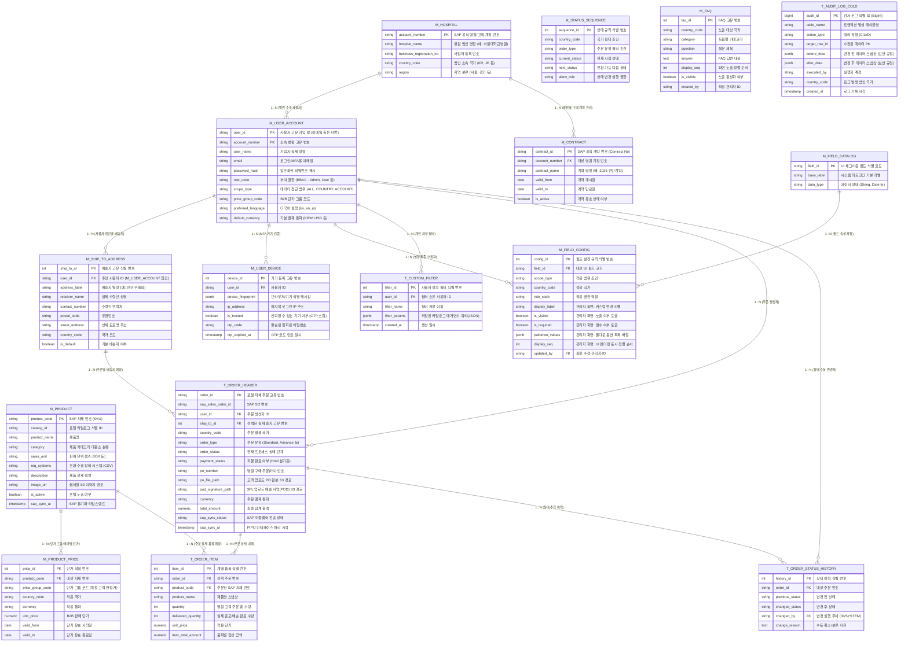

```mermaid
erDiagram
    %% ==========================================
    %% 1. 계층 구조 및 관계(Relationships) 정의
    %% ==========================================
    
    %% B2B 마스터 계층 (병원 -> 사용자 -> 배송지)
    M_HOSPITAL ||--o{ M_USER_ACCOUNT : "1 : N (병원 소속 사용자)"
    M_HOSPITAL ||--o{ M_CONTRACT : "1 : N (병원별 구매 계약 관리)"
    M_USER_ACCOUNT ||--o{ M_SHIP_TO_ADDRESS : "1 : N (사용자 개인별 배송지)"
    
    %% 보안 및 설정 관계
    M_USER_ACCOUNT ||--o{ M_USER_DEVICE : "1 : N (MFA 기기 검증)"
    M_USER_ACCOUNT ||--o{ M_FIELD_CONFIG : "1 : N (설정 최종 수정자)"
    M_USER_ACCOUNT ||--o{ T_CUSTOM_FILTER : "1 : N (개인 저장 필터)"
    M_FIELD_CATALOG ||--o{ M_FIELD_CONFIG : "1 : N (필드 속성 확장)"
    
    %% 상품 및 단가 관계
    M_PRODUCT ||--o{ M_PRODUCT_PRICE : "1 : N (단가 그룹/국가별 단가)"
    M_PRODUCT ||--o{ T_ORDER_ITEM : "1 : N (주문 상세 품목 매핑)"
    
    %% 트랜잭션 (주문-이력)
    T_ORDER_HEADER ||--|{ T_ORDER_ITEM : "1 : N (주문 상세 내역)"
    T_ORDER_HEADER ||--o{ T_ORDER_STATUS_HISTORY : "1 : N (상태 추적 이력)"
    M_SHIP_TO_ADDRESS ||--o{ T_ORDER_HEADER : "1 : N (주문별 배송지 매핑)"
    M_USER_ACCOUNT ||--o{ T_ORDER_HEADER : "1 : N (주문 생성자)"
    M_USER_ACCOUNT ||--o{ T_ORDER_STATUS_HISTORY : "1 : N (상태 수동 변경자)"

    %% ==========================================
    %% 2. 엔티티(Entities) 및 상세 필드 100% 복구
    %% ==========================================

    M_HOSPITAL {
        string account_number PK "SAP 공식 병원/고객 계정 번호"
        string hospital_name "병원 법인 명칭 (예: 서울대학교병원)"
        string business_registration_no "사업자 등록 번호"
        string country_code "법인 소속 국가 (KR, JP 등)"
        string region "지역 분류 (서울, 경기 등)"
    }

    M_USER_ACCOUNT {
        string user_id PK "사용자 고유 가입 ID (이메일 혹은 사번)"
        string account_number FK "소속 병원 고유 번호"
        string user_name "가입자 실제 성명"
        string email "로그인/MFA용 이메일"
        string password_hash "암호화된 비밀번호 해시"
        string role_code "부여 권한 (RBAC - Admin, User 등)"
        string scope_type "데이터 접근 범위 (ALL, COUNTRY, ACCOUNT)"
        string price_group_code "B2B 단가 그룹 코드"
        string preferred_language "다국어 설정 (ko, en, ja)"
        string default_currency "기본 결제 통화 (KRW, USD 등)"
    }

    M_USER_DEVICE {
        int device_id PK "기기 등록 고유 번호"
        string user_id FK "사용자 ID"
        jsonb device_fingerprint "브라우저/기기 식별 해시값"
        string ip_address "마지막 로그인 IP 주소"
        boolean is_trusted "신뢰할 수 있는 기기 여부 (OTP 스킵)"
        string otp_code "발송된 일회용 비밀번호"
        timestamp otp_expired_at "OTP 코드 만료 일시"
    }

    M_SHIP_TO_ADDRESS {
        int ship_to_id PK "배송지 고유 식별 번호"
        string user_id FK "주인 사용자 ID (M_USER_ACCOUNT 참조)"
        string address_label "배송지 별칭 (예: 신관 수술실)"
        string receiver_name "실제 수령인 성명"
        string contact_number "수령인 연락처"
        string postal_code "우편번호"
        string street_address "상세 도로명 주소"
        string country_code "국가 코드"
        boolean is_default "기본 배송지 여부"
    }

    M_CONTRACT {
        string contract_id PK "SAP 공식 계약 번호 (Contract No)"
        string account_number FK "대상 병원 계정 번호"
        string contract_name "계약 명칭 (예: 2026 연간계약)"
        date valid_from "계약 개시일"
        date valid_to "계약 만료일"
        boolean is_active "계약 유효 상태 여부"
    }

    M_PRODUCT {
        string product_code PK "SAP 자재 번호 (SKU)"
        string catalog_id "포털 카탈로그 식별 ID"
        string product_name "제품명"
        string category "제품 카테고리 대중소 분류"
        string sales_unit "판매 단위 (EA, BOX 등)"
        string req_systems "호환 수술 장비 시스템 (CSV)"
        string description "제품 상세 설명"
        string image_url "썸네일 S3 이미지 경로"
        boolean is_active "포털 노출 여부"
        timestamp sap_sync_at "SAP 동기화 타임스탬프"
    }

    M_PRODUCT_PRICE {
        int price_id PK "단가 식별 번호"
        string product_code FK "대상 자재 번호"
        string price_group_code "단가 그룹 코드 (특정 고객 한정가)"
        string country_code "적용 국가"
        string currency "적용 통화"
        numeric unit_price "B2B 판매 단가"
        date valid_from "단가 유효 시작일"
        date valid_to "단가 유효 종료일"
    }

    M_FIELD_CATALOG {
        string field_id PK "UI 체그아웃 필드 식별 코드"
        string base_label "시스템 하드코딩 기본 라벨"
        string data_type "데이터 형태 (String, Date 등)"
    }

    M_FIELD_CONFIG {
        int config_id PK "필드 설정 규칙 식별 번호"
        string field_id FK "대상 UI 필드 코드"
        string scope_type "적용 범위 조건"
        string country_code "적용 국가"
        string role_code "적용 권한 역할"
        string display_label "관리자 화면: 커스텀 변경 라벨"
        boolean is_visible "관리자 화면: 노출 여부 토글"
        boolean is_required "관리자 화면: 필수 여부 토글"
        jsonb pulldown_values "관리자 화면: 풀다운 옵션 목록 배열"
        int display_seq "관리자 화면: UI 렌더링 표시 정렬 순서"
        string updated_by FK "최종 수정 관리자 ID"
    }

    T_ORDER_HEADER {
        string order_id PK "포털 자체 주문 고유 번호"
        string sap_sales_order_id "SAP SO 번호"
        string user_id FK "주문 생성자 ID"
        int ship_to_id FK "선택된 실 배송지 고유 번호"
        string country_code "주문 발생 국가"
        string order_type "주문 유형 (Standard, Advance 등)"
        string order_status "현재 프로세스 상태 단계"
        string payment_status "지불 완료 여부 (Hold 분기용)"
        string po_number "병원 구매 주문(PO) 번호"
        string po_file_path "고객 업로드 PO 원본 S3 경로"
        string pod_signature_path "3PL 업로드 배송 서명(POD) S3 경로"
        string currency "주문 결제 통화"
        numeric total_amount "최종 합계 총액"
        string sap_sync_status "SAP 미들웨어 전송 상태"
        timestamp sap_sync_at "PIPO 인터페이스 처리 시각"
    }

    T_ORDER_ITEM {
        int item_id PK "개별 품목 식별 번호"
        string order_id FK "상위 주문 번호"
        string product_code FK "주문된 SAP 자재 번호"
        string product_name "제품명 스냅샷"
        int quantity "병원 고객 주문 총 수량"
        int delivered_quantity "실제 출고/배송 완료 수량"
        numeric unit_price "적용 단가"
        numeric item_total_amount "품목별 합산 금액"
    }

    T_ORDER_STATUS_HISTORY {
        int history_id PK "상태 이력 식별 번호"
        string order_id FK "대상 주문 번호"
        string previous_status "변경 전 상태"
        string changed_status "변경 후 상태"
        string changed_by FK "변경 실행 주체 (ID/SYSTEM)"
        text change_reason "수동 취소/보류 사유"
    }

    M_STATUS_SEQUENCE {
        int sequence_id PK "상태 규칙 식별 번호"
        string country_code "국가 필터 조건"
        string order_type "주문 유형 필터 조건"
        string current_status "현재 시점 상태"
        string next_status "전환 가능 다음 상태"
        string allow_role "상태 변경 실행 권한"
    }

    T_CUSTOM_FILTER {
        int filter_id PK "사용자 정의 필터 식별 번호"
        string user_id FK "필터 소유 사용자 ID"
        string filter_name "필터 저장 이름"
        jsonb filter_params "저장된 카탈로그 매개변수 쿼리(JSON)"
        timestamp created_at "생성 일시"
    }

    M_FAQ {
        int faq_id PK "FAQ 고유 번호"
        string country_code "노출 대상 국가"
        string category "도움말 카테고리"
        string question "질문 제목"
        text answer "FAQ 답변 내용"
        int display_seq "화면 노출 정렬 순서"
        boolean is_visible "노출 활성화 여부"
        string created_by "작성 관리자 ID"
    }

    T_AUDIT_LOG_COLD {
        bigint audit_id PK "감사 로그 식별 ID (BigInt)"
        string table_name "트랜잭션 발생 테이블명"
        string action_type "쿼리 유형 (C/U/D)"
        string target_row_id "수정된 데이터 PK"
        jsonb before_data "변경 전 데이터 스냅샷 (보안 규정)"
        jsonb after_data "변경 후 데이터 스냅샷 (보안 규정)"
        string executed_by "실행자 계정"
        string country_code "로그 발생 법인 국가"
        timestamp created_at "로그 기록 시각"
    }
```
