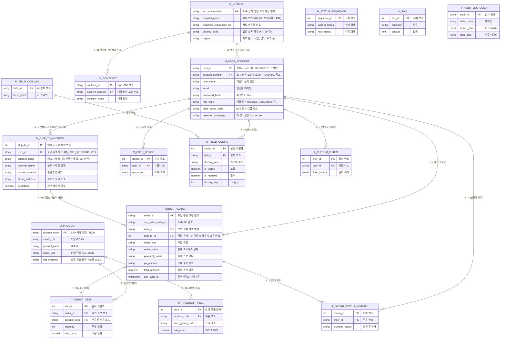

```mermaid
erDiagram
    %% ==========================================
    %% 1. 계층 구조 관계 정의 (정정 반영)
    %% ==========================================
    
    %% [핵심 정정] 최상위 병원 마스터 아래 개별 가입자들이 존재함
    M_HOSPITAL ||--o{ M_USER_ACCOUNT : "1 : N (병원 소속 직원 가입)"
    M_HOSPITAL ||--o{ M_CONTRACT : "1 : N (병원별 구매 계약 관리)"
    
    %% [핵심 정정] 배송지는 병원이 아니라 '개별 사용자(User)' 밑으로 귀속됨
    M_USER_ACCOUNT ||--o{ M_SHIP_TO_ADDRESS : "1 : N (개별 사용자별 개인 주소록)"
    
    %% 기타 보안 및 트랜잭션 관계
    M_USER_ACCOUNT ||--o{ M_USER_DEVICE : "1 : N (MFA 기기)"
    M_USER_ACCOUNT ||--o{ T_ORDER_HEADER : "1 : N (주문 생성자)"
    M_USER_ACCOUNT ||--o{ M_FIELD_CONFIG : "1 : N (규칙 관리)"
    M_USER_ACCOUNT ||--o{ T_ORDER_STATUS_HISTORY : "1 : N (변경자 기록)"
    M_USER_ACCOUNT ||--o{ T_CUSTOM_FILTER : "1 : N (개인 저장 필터)"
    
    M_FIELD_CATALOG ||--o{ M_FIELD_CONFIG : "1 : N (필드 속성)"
    M_PRODUCT ||--o{ M_PRODUCT_PRICE : "1 : N (그룹별 단가)"
    M_PRODUCT ||--o{ T_ORDER_ITEM : "1 : N (품목 매핑)"
    
    T_ORDER_HEADER ||--|{ T_ORDER_ITEM : "1 : N (주문 상세)"
    T_ORDER_HEADER ||--o{ T_ORDER_STATUS_HISTORY : "1 : N (상태 추적)"
    
    %% 주문서 생성 시 해당 유저의 주소록 중 하나를 매핑
    M_SHIP_TO_ADDRESS ||--o{ T_ORDER_HEADER : "1 : N (주문별 배송지 매핑)"

    %% ==========================================
    %% 2. 엔티티(Entities) 내부 정의
    %% ==========================================

    %% [신규 분리] 최상위 병원 기준 정보 마스터
    M_HOSPITAL {
        string account_number PK "SAP 공식 병원/고객 계정 번호"
        string hospital_name "병원 법인 명칭 (예: 서울대학교병원)"
        string business_registration_no "사업자 등록 번호"
        string country_code "법인 소속 국가 (KR, JP 등)"
        string region "지역 분류 (서울, 경기, 도쿄 등)"
    }

    %% 개별 사용자 계정 테이블 (병원 계정과 1:N 관계)
    M_USER_ACCOUNT {
        string user_id PK "사용자 고유 가입 ID (이메일 혹은 사번)"
        string account_number FK "소속 병원 고유 번호 (M_HOSPITAL 참조)"
        string user_name "가입자 실제 성명"
        string email "인증용 이메일"
        string password_hash "비밀번호 해시"
        string role_code "역할 권한 (Hospital_User, Admin 등)"
        string price_group_code "B2B 단가 그룹 코드"
        string preferred_language "다국어 설정 (ko, en, ja)"
    }

    %% 개별 배송지 테이블 (개별 가입자 유저와 1:N 관계로 정정)
    M_SHIP_TO_ADDRESS {
        int ship_to_id PK "배송지 고유 식별 번호"
        string user_id FK "주인 사용자 ID (M_USER_ACCOUNT 참조)"
        string address_label "배송지 별칭 (예: 신관 수술실, 1층 현관)"
        string receiver_name "실제 수령인 성명"
        string contact_number "수령인 연락처"
        string street_address "상세 도로명 주소"
        boolean is_default "기본 배송지 여부"
    }

    T_ORDER_HEADER {
        string order_id PK "포털 주문 고유 번호"
        string sap_sales_order_id "SAP SO 번호"
        string user_id FK "주문 생성 사용자 ID"
        int ship_to_id FK "해당 유저가 선택한 실 배송지 고유 번호"
        string order_type "주문 유형"
        string order_status "현재 프로세스 단계"
        string payment_status "지불 완료 여부"
        string po_number "구매 주문 번호"
        numeric total_amount "최종 합계 금액"
        timestamp sap_sync_at "인터페이스 처리 시각"
    }

    M_PRODUCT {
        string product_code PK "SAP 자재 번호 (SKU)"
        string catalog_id "카탈로그 ID"
        string product_name "제품명"
        string sales_unit "판매 단위 (EA, BOX)"
        string req_systems "호환 수술 장비 시스템 (CSV)"
    }

    T_ORDER_ITEM {
        int item_id PK "품목 식별자"
        string order_id FK "상위 주문 번호"
        string product_code FK "주문된 제품 코드"
        int quantity "주문 수량"
        numeric unit_price "적용 단가"
    }

    M_PRODUCT_PRICE {
        int price_id PK "단가 식별 번호"
        string product_code FK "제품 코드"
        string price_group_code "단가 그룹"
        numeric unit_price "B2B 판매가"
    }

    M_CONTRACT {
        string contract_id PK "SAP 계약 번호"
        string account_number FK "대상 병원 고유 번호"
        string contract_name "계약 명칭"
    }

    M_USER_DEVICE {
        int device_id PK "기기 번호"
        string user_id FK "사용자 ID"
        string otp_code "OTP 코드"
    }

    M_FIELD_CATALOG {
        string field_id PK "UI 필드 코드"
        string base_label "기본 라벨"
    }

    M_FIELD_CONFIG {
        int config_id PK "설정 식별자"
        string field_id FK "필드 코드"
        string display_label "커스텀 라벨"
        boolean is_visible "노출"
        boolean is_required "필수"
        int display_seq "UI 순서"
    }

    T_ORDER_STATUS_HISTORY {
        int history_id PK "이력 번호"
        string order_id FK "주문 번호"
        string changed_status "변경 후 상태"
    }

    M_STATUS_SEQUENCE {
        int sequence_id PK "규칙 번호"
        string current_status "현재 상태"
        string next_status "다음 상태"
    }

    T_CUSTOM_FILTER {
        int filter_id PK "필터 번호"
        string user_id FK "사용자 ID"
        jsonb filter_params "필터 쿼리"
    }

    M_FAQ {
        int faq_id PK "FAQ 번호"
        string question "질문"
        text answer "답변"
    }

    T_AUDIT_LOG_COLD {
        bigint audit_id PK "감사 번호"
        string table_name "테이블"
        jsonb before_data "이전 데이터"
        jsonb after_data "이후 데이터"
    }
```
