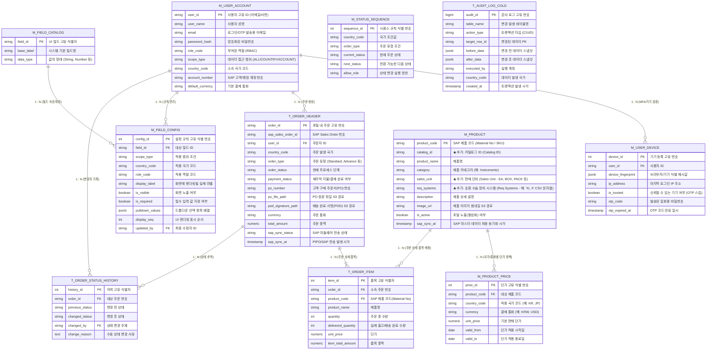

```mermaid
erDiagram
    %% ==========================================
    %% 1. 관계(Relationships) 정의
    %% ==========================================
    M_USER_ACCOUNT ||--o{ M_USER_DEVICE : "1 : N (MFA/기기 검증)"
    M_USER_ACCOUNT ||--o{ T_ORDER_HEADER : "1 : N (주문 생성)"
    M_USER_ACCOUNT ||--o{ M_FIELD_CONFIG : "1 : N (규칙 관리)"
    M_USER_ACCOUNT ||--o{ T_ORDER_STATUS_HISTORY : "1 : N (변경자 기록)"
    
    M_FIELD_CATALOG ||--o{ M_FIELD_CONFIG : "1 : N (필드 속성 확장)"
    
    M_PRODUCT ||--o{ M_PRODUCT_PRICE : "1 : N (국가/통화별 단가 정책)"
    M_PRODUCT ||--o{ T_ORDER_ITEM : "1 : N (주문 상세 품목 매핑)"
    
    T_ORDER_HEADER ||--|{ T_ORDER_ITEM : "1 : N (주문 상세 품목)"
    T_ORDER_HEADER ||--o{ T_ORDER_STATUS_HISTORY : "1 : N (상태 추적)"

    %% ==========================================
    %% 2. 엔티티(Entities) 정의 및 필드 코멘트
    %% ==========================================

    M_PRODUCT {
        string product_code PK "SAP 제품 코드 (Material No / SKU)"
        string catalog_id "★추가: 카탈로그 ID (Catalog ID)"
        string product_name "제품명"
        string category "제품 카테고리 (예: Instruments)"
        string sales_unit "★추가: 판매 단위 (Sales Unit - EA, BOX, PACK 등)"
        string req_systems "★추가: 호환 수술 장비 시스템 (Req Systems - 예: 'Xi, X' CSV 문자열)"
        string description "제품 상세 설명"
        string image_url "제품 이미지 썸네일 S3 경로"
        boolean is_active "포털 노출(활성화) 여부"
        timestamp sap_sync_at "SAP 마스터 데이터 최종 동기화 시각"
    }

    M_PRODUCT_PRICE {
        int price_id PK "단가 고유 식별 번호"
        string product_code FK "대상 제품 코드"
        string country_code "적용 국가 코드 (예: KR, JP)"
        string currency "결제 통화 (예: KRW, USD)"
        numeric unit_price "기본 판매 단가"
        date valid_from "단가 적용 시작일"
        date valid_to "단가 적용 종료일"
    }

    M_USER_ACCOUNT {
        string user_id PK "사용자 고유 ID (이메일/사번)"
        string user_name "사용자 성명"
        string email "로그인/OTP 발송용 이메일"
        string password_hash "암호화된 비밀번호"
        string role_code "부여된 역할 (RBAC)"
        string scope_type "데이터 접근 범위 (ALL/COUNTRY/ACCOUNT)"
        string country_code "소속 국가 코드"
        string account_number "SAP 고객/병원 계정 번호"
        string default_currency "기본 결제 통화"
    }

    M_USER_DEVICE {
        int device_id PK "기기 등록 고유 번호"
        string user_id FK "사용자 ID"
        jsonb device_fingerprint "브라우저/기기 식별 해시값"
        string ip_address "마지막 로그인 IP 주소"
        boolean is_trusted "신뢰할 수 있는 기기 여부 (OTP 스킵)"
        string otp_code "발송된 일회용 비밀번호"
        timestamp otp_expired_at "OTP 코드 만료 일시"
    }

    M_FIELD_CATALOG {
        string field_id PK "UI 필드 고유 식별자"
        string base_label "시스템 기본 필드명"
        string data_type "값의 형태 (String, Number 등)"
    }

    M_FIELD_CONFIG {
        int config_id PK "설정 규칙 고유 식별 번호"
        string field_id FK "대상 필드 ID"
        string scope_type "적용 범위 조건"
        string country_code "적용 국가 코드"
        string role_code "적용 역할 코드"
        string display_label "화면에 렌더링될 실제 라벨"
        boolean is_visible "화면 노출 여부"
        boolean is_required "필수 입력 값 지정 여부"
        jsonb pulldown_values "드롭다운 선택 항목 배열"
        int display_seq "UI 렌더링 표시 순서"
        string updated_by FK "최종 수정자 ID"
    }

    T_ORDER_HEADER {
        string order_id PK "포털 내 주문 고유 번호"
        string sap_sales_order_id "SAP Sales Order 번호"
        string user_id FK "주문자 ID"
        string country_code "주문 발생 국가"
        string order_type "주문 유형 (Standard, Advance 등)"
        string order_status "현재 프로세스 단계"
        string payment_status "재무적 지불/결제 완료 여부"
        string po_number "고객 구매 주문서(PO) 번호"
        string po_file_path "PO 원본 파일 S3 경로"
        string pod_signature_path "배송 완료 서명(POD) S3 경로"
        string currency "주문 통화"
        numeric total_amount "주문 총액"
        string sap_sync_status "SAP 미들웨어 전송 상태"
        timestamp sap_sync_at "PIPO/SAP 전송 발생 시각"
    }

    T_ORDER_ITEM {
        int item_id PK "품목 고유 식별자"
        string order_id FK "소속 주문 번호"
        string product_code FK "SAP 제품 코드(Material No)"
        string product_name "제품명"
        int quantity "주문 총 수량"
        int delivered_quantity "실제 출고/배송 완료 수량"
        numeric unit_price "단가"
        numeric item_total_amount "품목 총액"
    }

    T_ORDER_STATUS_HISTORY {
        int history_id PK "이력 고유 식별자"
        string order_id FK "대상 주문 번호"
        string previous_status "변경 전 상태"
        string changed_status "변경 후 상태"
        string changed_by FK "상태 변경 주체"
        text change_reason "수동 상태 변경 사유"
    }

    M_STATUS_SEQUENCE {
        int sequence_id PK "시퀀스 규칙 식별 번호"
        string country_code "국가 조건값"
        string order_type "주문 유형 조건"
        string current_status "현재 주문 상태"
        string next_status "전환 가능한 다음 상태"
        string allow_role "상태 변경 실행 권한"
    }

    T_AUDIT_LOG_COLD {
        bigint audit_id PK "감사 로그 고유 번호"
        string table_name "변경 발생 테이블명"
        string action_type "트랜잭션 타입 (C/U/D)"
        string target_row_id "변경된 데이터 PK"
        jsonb before_data "변경 전 데이터 스냅샷"
        jsonb after_data "변경 후 데이터 스냅샷"
        string executed_by "실행 계정"
        string country_code "데이터 발생 국가"
        timestamp created_at "트랜잭션 발생 시각"
    }
```
