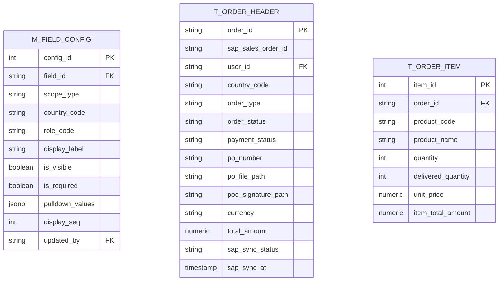

```mermaid
erDiagram

    M_FIELD_CONFIG {
        int config_id PK
        string field_id FK
        string scope_type
        string country_code
        string role_code
        string display_label
        boolean is_visible
        boolean is_required
        jsonb pulldown_values
        int display_seq
        string updated_by FK
    }

    T_ORDER_HEADER {
        string order_id PK
        string sap_sales_order_id
        string user_id FK
        string country_code
        string order_type
        string order_status
        string payment_status
        string po_number
        string po_file_path
        string pod_signature_path
        string currency
        numeric total_amount
        string sap_sync_status
        timestamp sap_sync_at
    }

    T_ORDER_ITEM {
        int item_id PK
        string order_id FK
        string product_code
        string product_name
        int quantity
        int delivered_quantity
        numeric unit_price
        numeric item_total_amount
    }
```
