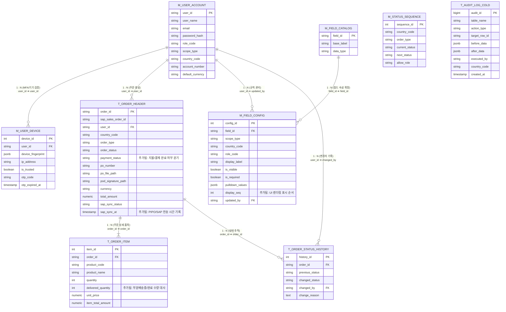

```mermaid
erDiagram
    %% 1. 관계(Relationships) 정의
    M_USER_ACCOUNT ||--o{ M_USER_DEVICE : "1 : N (MFA/기기 검증)<br>user_id ➔ user_id"
    M_USER_ACCOUNT ||--o{ T_ORDER_HEADER : "1 : N (주문 생성)<br>user_id ➔ user_id"
    M_USER_ACCOUNT ||--o{ M_FIELD_CONFIG : "1 : N (규칙 관리)<br>user_id ➔ updated_by"
    M_USER_ACCOUNT ||--o{ T_ORDER_STATUS_HISTORY : "1 : N (변경자 기록)<br>user_id ➔ changed_by"
    
    M_FIELD_CATALOG ||--o{ M_FIELD_CONFIG : "1 : N (필드 속성 확장)<br>field_id ➔ field_id"
    
    T_ORDER_HEADER ||--|{ T_ORDER_ITEM : "1 : N (주문 상세 품목)<br>order_id ➔ order_id"
    T_ORDER_HEADER ||--o{ T_ORDER_STATUS_HISTORY : "1 : N (상태 추적)<br>order_id ➔ order_id"

    %% 2. 엔티티(Entities) 정의
    M_USER_ACCOUNT {
        string user_id PK
        string user_name
        string email
        string password_hash
        string role_code
        string scope_type
        string country_code
        string account_number
        string default_currency
    }

    M_USER_DEVICE {
        int device_id PK
        string user_id FK
        jsonb device_fingerprint
        string ip_address
        boolean is_trusted
        string otp_code
        timestamp otp_expired_at
    }

    M_FIELD_CATALOG {
        string field_id PK
        string base_label
        string data_type
    }

    M_FIELD_CONFIG {
        int config_id PK
        string field_id FK
        string scope_type
        string country_code
        string role_code
        string display_label
        boolean is_visible
        boolean is_required
        jsonb pulldown_values
        int display_seq "추가됨: UI 렌더링 표시 순서"
        string updated_by FK
    }

    T_ORDER_HEADER {
        string order_id PK
        string sap_sales_order_id
        string user_id FK
        string country_code
        string order_type
        string order_status
        string payment_status "추가됨: 지불/결제 완료 여부 분기"
        string po_number
        string po_file_path
        string pod_signature_path
        string currency
        numeric total_amount
        string sap_sync_status
        timestamp sap_sync_at "추가됨: PIPO/SAP 전송 시간 기록"
    }

    T_ORDER_ITEM {
        int item_id PK
        string order_id FK
        string product_code
        string product_name
        int quantity
        int delivered_quantity "추가됨: 부분배송중/완료 수량 대사"
        numeric unit_price
        numeric item_total_amount
    }

    T_ORDER_STATUS_HISTORY {
        int history_id PK
        string order_id FK
        string previous_status
        string changed_status
        string changed_by FK
        text change_reason
    }

    M_STATUS_SEQUENCE {
        int sequence_id PK
        string country_code
        string order_type
        string current_status
        string next_status
        string allow_role
    }

    T_AUDIT_LOG_COLD {
        bigint audit_id PK
        string table_name
        string action_type
        string target_row_id
        jsonb before_data
        jsonb after_data
        string executed_by
        string country_code
        timestamp created_at
    }
```
