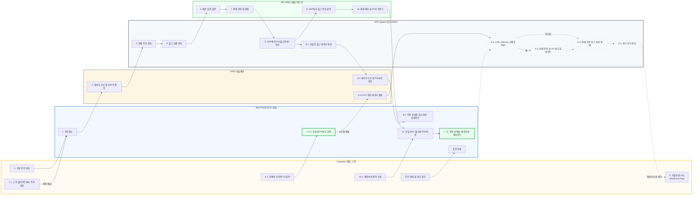

```mermaid
flowchart LR
    %% 전체는 가로(LR) 구조를 유지하되, 각 레인 안의 박스들만 아래로(TB) 떨어지게 세팅하여 가로 폭 압축
    
    subgraph 레인1_Hospitals ["Hospitals (병원 고객)"]
        direction TB
        step1["1. 구매 주문 생성"]
        step1_1["1.1. 고객 웹사이트에서 주문 생성"]
        step_SH["주문 상태 및 대기 업무"]
        step10_1["10.1. 병원에서 품목 수령"]
        step_A1["A.1. 선배송 주문용 PO입력"]
        step_F["F. 지불용 청구서 <br>(Invoice to Pay)"]
    end

    subgraph 레인2_New_Portal ["New Portal (신규 포털)"]
        direction TB
        step2["2. 주문접수"]
        step_SH2["주문 상태"]
        step8_3["8.3. 주문 상태를 '출고완료' 업데이트"]
        step11["11. 포털 BOX 폴더에 POD저장"]
        step12["📢 12. 주문 상태를 '배송완료' 업데이트"]:::inScopeEnd
        step_A2["📢 A.2. 포털에 PO번호 입력"]:::inScopeEnd
    end

    subgraph 레인3_PIPO_System ["PIPO 미들웨어"]
        direction TB
        step3["3. 데이터 수신 및 SAP로 전송"]
        step8_2["8.2 데이터 수신 및 Portal로 전송"]
        step_A2_mw["A.2.5 PO 연동 데이터 변환"]
    end

    subgraph 레인4_SAP_System ["SAP System (본사 ERP)"]
        direction TB
        step4["4. 판매 주문 생성"]
        step5["5. 출고 납품 생성"]
        step8["8. SAP에서 PGI(출고완료) 처리"]
        step8_1["8.1. 포털로 출고 데이터 전송"]
        step_A3["A.3. 판매 주문 내 PO 번호 업데이트"]:::outScope
        step_A3_1{"A.3.1 Adv. Delivery 선배송 여부?"}:::outScope
        step_A4["A.4. 판매 주문 청구 보류 해제"]:::outScope
        step_A5["A.5. 청구 문서 생성"]:::outScope
    end

    subgraph 레인5_Logistics ["3PL WMS (물류 파트너)"]
        direction TB
        step6["6. 배송 일정 출력"]
        step7["7. 제품 피킹 및 패킹"]
        step9["9. SAP에서 출고 전표 발행"]
        step10["10. 제품 배송 및 POD 업로드"]
    end

    %% [인터페이스 동선 연결 - 공백 버그 해결]
    step1 --> step2
    step1_1 -->|"주문 제출"| step2
    step2 --> step3
    step3 --> step4
    step4 --> step5
    step5 --> step6
    step6 --> step7
    step7 --> step8
    step8 --> step8_1
    step8_1 --> step8_2
    step8_2 --> step8_3
    step8 --> step9
    step9 --> step10
    step10 --> step11
    step10_1 --> step11
    step11 --> step12
    step_SH --> step_SH2
    
    %% 선배송 및 범위 외 오프라인 업무 흐름
    step_A1 --> step_A2
    step_A2 -->|"CS 팀 알림"| step_A2_mw
    step_A2_mw --> step_A3_1
    step12 -.-> step_A3_1
    
    step_A3_1 -.->|"예"| step_A3
    step_A3_1 -.->|"아니오"| step_A4
    step_A3 -.-> step_A4
    step_A4 -.-> step_A5
    step_A5 -.->|"관리자 수동 청구"| step_F

    %% 스타일 및 클래스 가드
    classDef inScopeEnd fill:#e6ffed,stroke:#28a745,stroke-width:3px;
    classDef outScope fill:#f6f8fa,stroke:#d1d5da,stroke-width:1px,stroke-dasharray: 5 5;

    style 레인1_Hospitals fill:#fffbf2,stroke:#ffb300,stroke-width:2px
    style 레인2_New_Portal fill:#f1f8ff,stroke:#0366d6,stroke-width:2px
    style 레인3_PIPO_System fill:#fdf6e3,stroke:#657b83,stroke-width:2px
    style 레인4_SAP_System fill:#f6f8fa,stroke:#24292e,stroke-width:2px
    style 레인5_Logistics fill:#f0fff4,stroke:#28a745,stroke-width:2px
    

```
